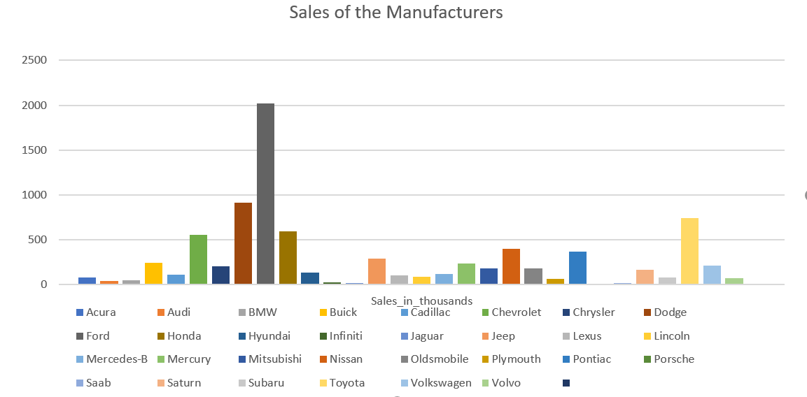
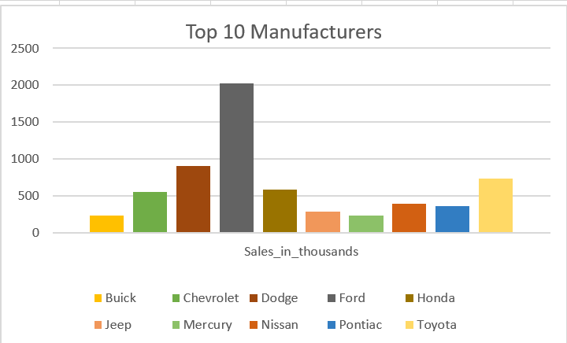

# CarSales-map-reduce

## DataSet
This is the data of **CarSales** from different manufacturers and their models in a year and this data also contains the details of the car like **Engine_size , Horsepower , Wheelbase , Width , Length , Curb_weight , Fuel_capacity , Fuel_efficiency , Latest_Launch , Power_perf_factor** 

[Link to Dataset](https://www.kaggle.com/gagandeep16/car-sales)

## Question to be answered from this map reduce
From this map reduce we have find out total car sales by each manufacturer and summarize the results

## Summary
The following bar chart show's us total sales in thoushands by each manufacturer

From the above graph we can predict the following outcomes:
* The highest sales was around 2000 from FORD.
* The Least sales was from Porsche.

The Following bar graph show's us the sales of top 10 manufacturers.
* From the above graph we can see that Ford was the first Manufacturer with the most no of sales in a year.
* Only 5 manufacturers have crossed the 500 thousand sales in a year.
